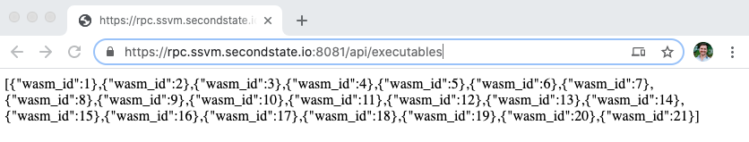

# wasm-joey Usage

Once deployed wasm-joey performs tasks which are all defined as service endpoints (URLs). These tasks/services include the following ...
- Set Wasm executable
- Get Wasm executable
- Execute Wasm executable
- Update Wasm executable
- Remove Wasm executable


# Storage
wasm-joey (using MySQL) stores the actual executable Wasm binary code, as well as all other information relating to execution (who, what, when etc.). This information can be used to generate usage reports, auditing and so forth.

# Request / Response

## Request data specifications
Please read the following request types (load, read, execute, update, delete) and take note of the data specifications. We provide examples for each.

### Set a Wasm executable in hex format
Set a Wasm binary into the system and return a freshly minted `wasm_id` back to the calling code
#### Verb
```
POST
```
#### Endpoint
scheme `https`, netloc `rpc.ssvm.secondstate.io`, port `3000`, path `executables`
```
https://rpc.ssvm.secondstate.io:8081/api/executables
```
#### Header
Content-Type
```
Content-Type: application/json
```
#### Body
Wasm binary can be converted to hexadecimal string using the following command. Please ensure to add the `0x` to the start of the string as shown, in the request JSON, below.
```
 xxd -p wasm_file.wasm | tr -d $'\n'
```
The hexadecimal string can then be passed into wasm-joey for future execution
```
{"wasm_hex": "0x1234567890"}
```
#### Curl example
```
curl --location --request POST https://rpc.ssvm.secondstate.io:8081/api/executables' \
--header 'Content-Type: application/json' \
--data-raw '{"wasm_hex":"0x1234567890"}'
```
#### Response
The above request will return a response in the following JSON format 
```
{"wasm_id":8}
```
### Get all Wasm executable identification numbers (as list) 
Get all Wasm executable `wasm_id`s The `wasm_id` is they key use to perform other tasks
#### Verb
```
GET
```
#### Endpoint
scheme `https`, netloc `rpc.ssvm.secondstate.io`, port `3000`, path `executables`
```
https://rpc.ssvm.secondstate.io:8081/api/executables
```
#### Body
No body required
#### Browser example
Please note, GET requests can be performed [in a browser](https://rpc.ssvm.secondstate.io:8081/api/executables) (without the need for REST/RPC client or command line code)

#### Curl example
```
curl --location --request GET 'https://rpc.ssvm.secondstate.io:8081/api/executables' \
--header 'Content-Type: application/json' \
--data-raw ''
```
#### Response
```
[{"wasm_id":1},{"wasm_id":2},{"wasm_id":3},{"wasm_id":4} ... {"wasm_id":12},{"wasm_id":13},{"wasm_id":14},{"wasm_id":15},{"wasm_id":16}]
```

### Get a specific Wasm executable - see below for optional filtering usage
Get a Wasm binary which has a certain `wasm_id` and return that specific Wasm executable back to the calling code as a Buffer
#### Verb
```
GET
```
#### Endpoint
scheme `https`, netloc `rpc.ssvm.secondstate.io`, port `3000`, path `executables`, `wasm_id`
```
https://rpc.ssvm.secondstate.io:8081/api/executables/1
```
#### Body
No body required
#### Curl example
```
curl --location --request GET 'https://rpc.ssvm.secondstate.io:8081/api/executables/1' \
--header 'Content-Type: application/json' \
--data-raw ''
```
#### Response
```
{"wasm_id":1,"wasm_description":"Put here by the API","wasm_as_hex":"0x1234567890","wasm_as_buffer":{"type":"Buffer","data":[48,120,49,50,51,52,53,54,55,56,57,48]}}
```
### Get a specific Wasm executable - with optional filtering
The following query string syntax will filter the response to ONLY return the fields which are explicitly listed.
For example the following syntax will only return the `wasm_id` field
```
https://rpc.ssvm.secondstate.io:8081/api/executables/1?filterBy=["wasm_id"]
```
Result
```
{"wasm_id":1}
```
The following syntax will only return `wasm_as_hex` and `wasm_description` 
```
https://rpc.ssvm.secondstate.io:8081/api/executables/1?filterBy=["wasm_as_hex", "wasm_description"]
```
Result
```
{"wasm_as_hex":"0x1234567890","wasm_description":"Put here by the API"}
```

### Execute a Wasm function
Execute a specific function which resides in a Wasm executable. The Wasm executable must have previously been set/updated into the wasm-joey system and will be identified by its `wasm_id`
Request Type
```
POST
```
Endpoint
scheme `https`, netloc `rpc.ssvm.secondstate.io`, port `3000`, path `executables`, wasm_id `1`
```
https://rpc.ssvm.secondstate.io:8081/api/executables/1
```
Header
Content-Type
```
Content-Type: application/json
```
Body
```
{"wasm_method":"add", "params":[1, 2]}
```
Curl example
```
curl --location --request POST 'https://rpc.ssvm.secondstate.io:8081/api/executables/1' \
--header 'Content-Type: application/json' \
--data-raw '{"wasm_method":"add", "params":[1, 2]}'
```

### Update (Hot Swap) a Wasm executable
Remove and replace an existing Wasm executable in hex format. Future execute calls will of course run this new executable's logic
```
PUT
```
Endpoint
scheme `https`, netloc `rpc.ssvm.secondstate.io`, port `3000`, path `executables`, wasm_id `1`
```
https://rpc.ssvm.secondstate.io:8081/api/executables/1
```
Header
Content-Type
```
Content-Type: application/json
```
Body
```
{"wasm_hex": "0x8888888"}
```
Curl example
```
curl --location --request PUT 'https://rpc.ssvm.secondstate.io:8081/api/executables/1' \
--header 'Content-Type: application/json' \
--data-raw '{"wasm_hex": "0x8888888"}'
```
Result, confirms which item was updated
```
{"wasm_id":1}
```
### Delete a Wasm executable
Delete an existing Wasm executable in hex format, from the system
```
DELETE
```
Endpoint
scheme `https`, netloc `rpc.ssvm.secondstate.io`, port `3000`, path `executables`, wasm_id `1`
```
https://rpc.ssvm.secondstate.io:8081/api/executables/1
```
Curl example 
```
curl --location --request DELETE 'https://rpc.ssvm.secondstate.io:8081/api/executables/1' \
--header 'Content-Type: application/json' \
--data-raw ''
```
Result, confirms which item was deleted
```
{"wasm_id":1}
```
